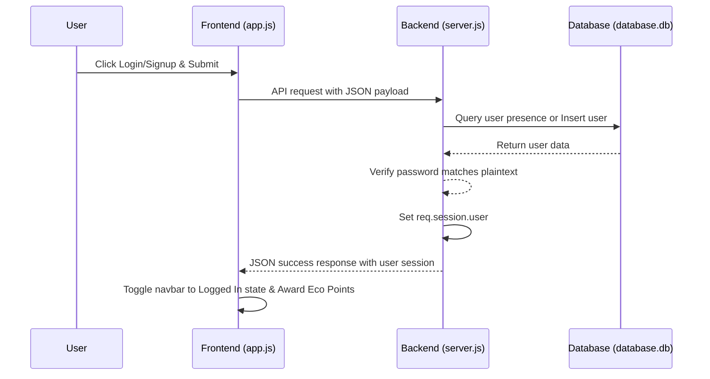
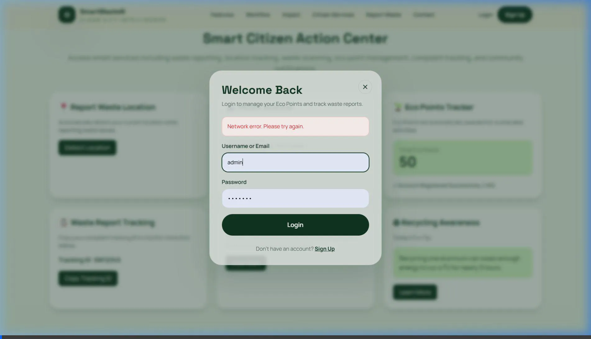

# SmartWasteAI - Authentication System Walkthrough & Setup Guide

This guide provides a comprehensive overview of the newly implemented authentication system, directory structure, system architecture, and steps required to run the project.

---

## 📂 Project Directory Structure

The project has been restructured to separate client-side assets from server-side logic:

```
SmartWasteAI/
├── public/                 # Client-side Static Assets
│   ├── index.html          # Main HTML structure with login/signup modals
│   ├── app.js              # Frontend logic, event handlers, and API fetching
│   ├── style.css           # Vanilla styling & layout overrides
│   └── tailwind-config.js  # Tailwind CSS configurations & color design systems
├── server/                 # Express Backend Server
│   ├── database.db         # SQLite database file (committed for testing/labs)
│   ├── package.json        # Node.js backend dependencies and start scripts
│   ├── server.js           # Express app, SQLite DB init, and API endpoints
│   └── node_modules/       # Local backend dependencies (ignored via .gitignore)
└── .gitignore              # Git ignore configuration
```

---

## ⚙️ How It Works (System Architecture)



### 1. Backend Layer (`server/server.js`)

- **SQLite Database:** Connected to a local database (`database.db`). On startup, it automatically creates a `users` table:
  ```sql
  CREATE TABLE IF NOT EXISTS users (
      id INTEGER PRIMARY KEY AUTOINCREMENT,
      username TEXT UNIQUE NOT NULL,
      email TEXT UNIQUE NOT NULL,
      password TEXT NOT NULL,
      created_at DATETIME DEFAULT CURRENT_TIMESTAMP
  );
  ```
- **Session Management:** Configured `express-session` middleware to persist logged-in sessions via cookies.
- **REST API Endpoints:**
  - `POST /api/signup`: Creates a new user with validation (username ≥ 3 chars, password ≥ 6 chars, valid email syntax). Sets the session upon success.
  - `POST /api/login`: Looks up username/email, compares the password in plaintext, and logs the user in.
  - `GET /api/me`: Returns current user session details to keep the client logged in on page reloads.
  - `POST /api/logout`: Destroys the session and clears the cookie.
- **Static Assets Serving:** Serves all frontend code inside `public/` using `express.static`.

### 2. Frontend Layer (`public/index.html` & `public/app.js`)

- **Modals:** Embedded custom modals for login/signup matching the glassmorphic styling, using deep forest greens and ivory/sand tones.
- **Dynamic Navbar:** Synchronizes authentication state with the server. Displays "Login" / "Sign Up" buttons when logged out, and a greeting + first-letter user avatar when logged in.
- **Eco Points System:** Awards 50 Eco Points for new signups and 10 Eco Points for returning logins, displaying the accomplishments in the live activity log.

---

## 🚀 Getting Started (Onboarding Guide)

Follow these steps to run the project locally after cloning or pulling the repository:

### Step 1: Navigate to the Server Directory

Open your terminal in the workspace root and go to the server directory:

```bash
cd server
```

### Step 2: Install Dependencies

Install all required Node.js backend modules defined in `package.json`:

```bash
npm install
```

### Step 3: Run the Server

Start the Express server using the NPM start script:

```bash
npm start
```

*Alternatively, you can run:*

```bash
node server.js
```

You should see the following logs in your terminal:

```
Server is running at http://localhost:3000
Connected to the SQLite database.
Users table ready.
```

### Step 4: Open the Application

Open your browser and navigate to:
[http://localhost:3000](http://localhost:3000)

---

## 🧪 Verification & Testing Results

### 1. Database Persistence Verification

We verified that the registration endpoint saves user credentials in plaintext in the database:

```json
[
  {
    "id": 1,
    "username": "plaintest",
    "email": "plaintest@example.com",
    "password": "mysecretpassword",
    "created_at": "2026-07-04 03:42:55"
  }
]
```

### 2. Browser Verification Recording

We verified the complete login, signup, navbar states, dropdown details, and logout flow using the browser subagent. The session recording is saved and can be viewed here:


